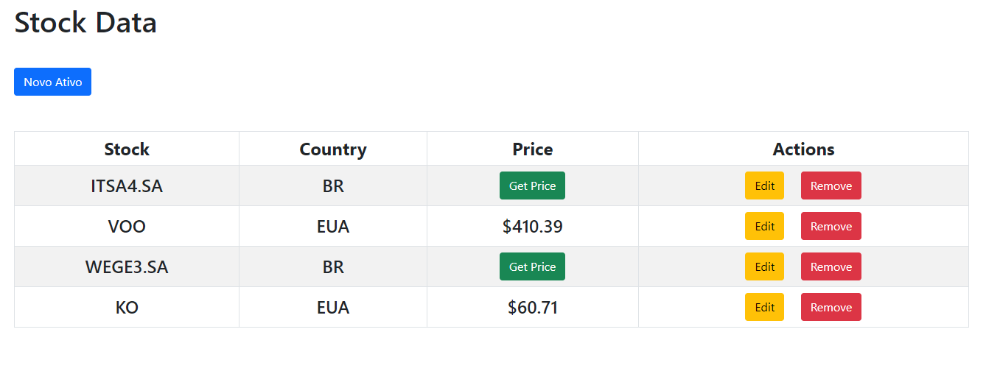

# Stock-Data

## Descrição
Este é um aplicativo web desenvolvido em Flask que permite aos usuários adicionar, remover ou editar ações de bolsa de valores e verificar os preços das ações em tempo real. Ele usa Python, JavaScript e a biblioteca yfinance para obter as informações das ações.

## Funcionalidades
- Adicionar uma nova ação com um símbolo de ticker e nome
- Remover uma ação existente da lista
- Editar o nome de uma ação existente
- Verificar o preço atual de uma ação selecionada em tempo real
- Listar todas as ações adicionadas com seus nomes e preços atualizados

## Pré-requisitos
- Python 3.x
- Flask (instalado via `pip install Flask`)
- yfinance (instalado via `pip install yfinance`)

## Instalação e Execução
1. Clone este repositório para o seu ambiente local.
2. Instale as dependências necessárias usando o comando `pip install -r requirements.txt`.
3. Execute o aplicativo usando o comando `python app.py`.
4. Acesse o aplicativo em seu navegador usando o endereço `http://localhost:5000`.

## Como Usar
1. Na página inicial, você verá uma lista de ações adicionadas, seus tickers e preços atuais (apertando o botão Get Price).
2. Para adicionar uma nova ação, clique no botão "Novo Ativo" e preencha o formulário com o símbolo de ticker e país (EU ou BR), no caso de ser Brasil, adicionar um (.SA) no final do ticker. Clique em "Adicionar" para adicionar a ação à lista.
3. Para remover uma ação, clique no botão "Remove" ao lado da ação que deseja excluir.
4. Para editar o ticker de uma ação existente, clique no botão "Edit" ao lado da ação e altere o nome no formulário exibido.
5. Para verificar o preço atual de uma ação, clique no botão "Get Price" ao lado da ação e o preço atual será exibido na lista.
6. As ações e seus preços são atualizados automaticamente a cada intervalo de tempo.

## Contribuindo
Se você encontrar bugs ou tiver sugestões de melhorias, sinta-se à vontade para abrir uma "Issue" ou enviar um "Pull Request". Sua contribuição é bem-vinda!

## Licença
Este projeto está licenciado sob a Licença MIT - consulte o arquivo LICENSE para obter detalhes.

## Autor
[Ronei Alves](https://github.com/ronei-alves)
